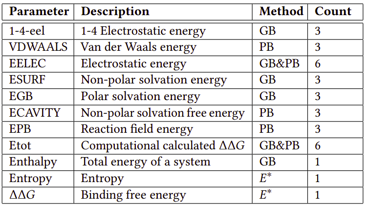

# Datasets
This repository contains three datasets: PDBBind, Mobley, and Verachem. The datasets consist of structures in PDB format, along with information calculated using the AmberTools MMPBSA.py tool and the VeraChem application.

## PDBBind
The PDBBind dataset is a collection of protein-ligand complexes with experimentally determined binding affinities. The structures are provided in PDB format and have been processed using the AmberTools MMPBSA.py tool to calculate various molecular properties, including binding energies, binding residues, and interaction energies.
The PDBBind structures provided in this dataset are created by applying post precossing methods on original PDBBind dataset [1]. 
 
The dataset is stored in `pdbbind_revisioned` directory in PDB format.
Result of MMP(G)BSA calculation is available in `pdbbind.csv` file.
Features included in the CSV file explained in the following table.

## Mobley
The Mobley dataset comprises a diverse set of small molecules and associated protein targets. The structures are provided in PDB format and have been processed using the AmberTools MMPBSA.py tool and also VerraChem to calculate binding energies, solvation energies, and other relevant properties [2].

## Aminos
Sample Amino acid structures.

# References
[1] Wang, R., Fang, X., Lu, Y., Yang, C.-Y., Wang, S. (2005). The PDBbind Database: Methodologies and Updates. Journal of Medicinal Chemistry, 48(12), 4111-4119. DOI: 10.1021/jm048957q
 
 
[2] Mobley DL, Gilson MK. Predicting Binding Free Energies: Frontiers and Benchmarks. Annu Rev Biophys. 2017 May 22;46:531-558. doi: 10.1146/annurev-biophys-070816-033654. Epub 2017 Apr 7. PMID: 28399632; PMCID: PMC5544526.
